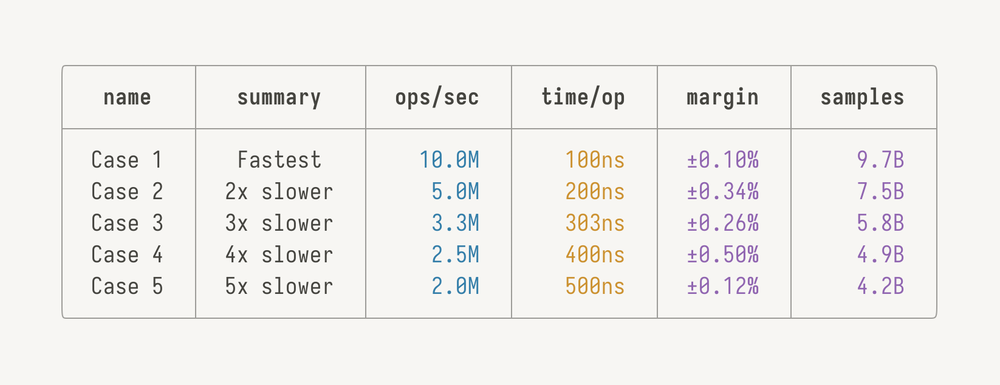
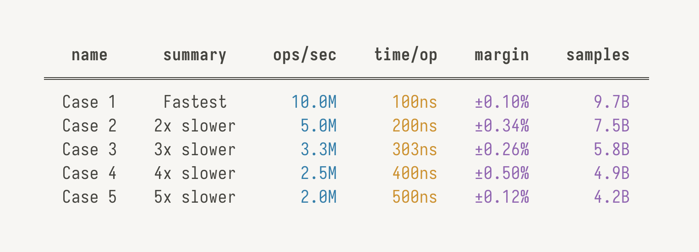
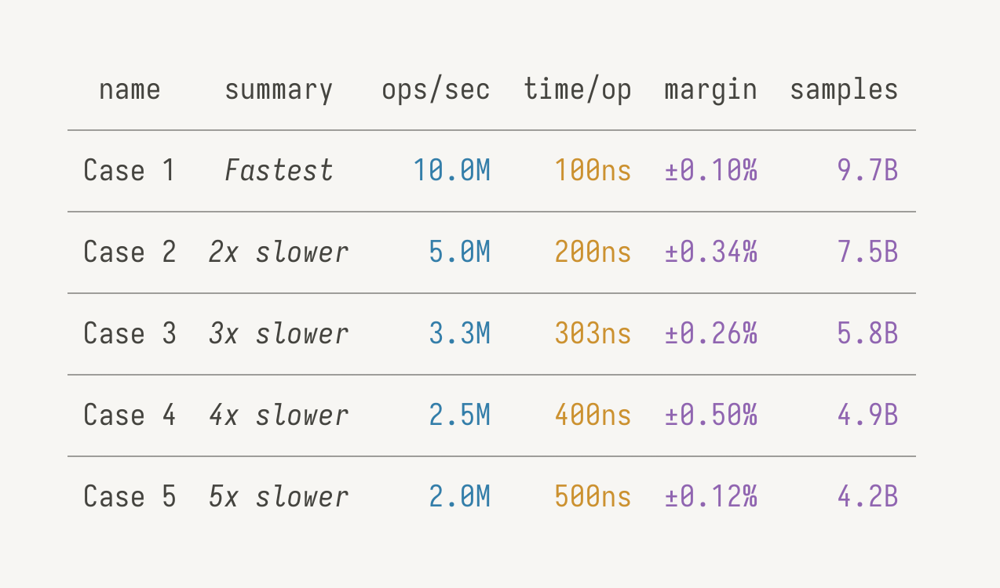
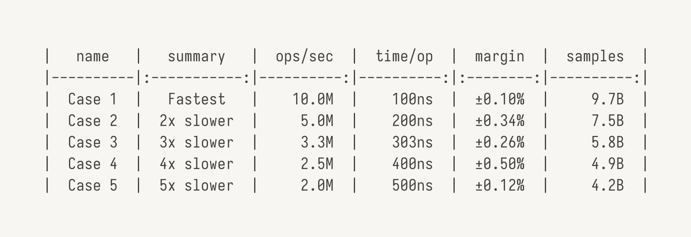

<div align="center">

<h1>tables</h1>

**Highly customizable tables for CLIs and Markdown.**


</div>

A library for creating complex tables that can handle unicode, alignments, styling, truncation, borders and paddings, primarily for printing to terminals.

It exposes high-level and easy to use functions that come with some defaults, as well as low-level building blocks that you can use to completely customize every single row and column if necessary!

## Examples

<div align="center">
    <h3>CLI</h3>
    
    
    
    <h3>Markdown</h3>
    
</div>

## Installation

```sh
npm install @monstermann/tables
yarn add @monstermann/tables
pnpm add @monstermann/tables
```

## Getting Started

```ts
import { cli } from '@monstermann/tables'

const result = cli.createTable({
    columns: ['foo', 'bar'],
    rows: [
        { foo: 'Foo', bar: 'Bar' },
    ],
})

console.log(result)
```

## Overview

- [CLI](./docs/cli.md#cli)
    - [Example](./docs/cli.md#example)
    - [Options](./docs/cli.md#options)
    - [Alignments](./docs/cli.md#alignments)
    - [Styles](./docs/cli.md#styles)
    - [Advanced](./docs/cli.md#advanced)
        - [`createConfig`](./docs/cli.md#createconfig)
        - [`createHeader`](./docs/cli.md#createheader)
        - [`createRow`](./docs/cli.md#createrow)
        - [`createRowSeparator`](./docs/cli.md#createrowseparator)
        - [`createBorderTop`](./docs/cli.md#createbordertop)
        - [`createBorderBottom`](./docs/cli.md#createborderbottom)
        - [`createBorder`](./docs/cli.md#createborder)
        - [`createCell`](./docs/cli.md#createcell)
- [Markdown](./docs/markdown.md#markdown)
    - [Example](./docs/markdown.md#example)
    - [Options](./docs/markdown.md#options)
- [Core](./docs/core.md#core)
    - [`Cell`](./docs/core.md#cell)
    - [`renderRows`](./docs/core.md#renderrows)
    - [`renderCell`](./docs/core.md#rendercell)
    - [`getCellContentWidth`](./docs/core#getcellcontentwidth)
    - [`getCellDecorationsWidth`](./docs/core#getcelldecorationswidth)
    - [`getCellWidth`](./docs/core.md#getcellwidth)
